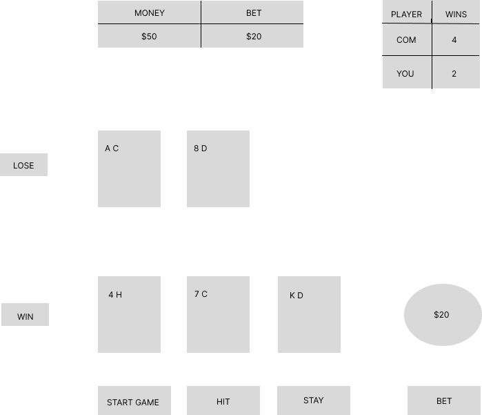

# Black Jack

Black Jack is a simple game that the player who got 21 or close to 21 within 21 will become the winner. 
 
 
 

## Technology Used

The following technology was used in order to create Black Jack: 

- Javascript
- HTML
- CSS

## Getting Started

To play this game live you can click this [link](http://something.com)

Instructions:

-  Click on the hit button to draw another card and pass button to 
   not to draw another card and compete against the computer about 
   points.
-  Click on bet Amount button to bet the amount of money you put 
   on the input and reset cards button to reset cards and reset 
   money button to reset money to $100 and reset score button to 
   set the score to 0. 

## Next Steps

Version 2: 

-   As a user, the player can see the statistics like how many 
    times the computer wins and the player wins.

-   As a user, if the user won more than 10 times, the winning 
    percentage score board and the number of wins score board will 
    be shown on the board. 

Version 3: 

-   As a user, the player can see the score board of the money 
    which the player got by winning.

-   As a user, the player can see the champion cup if the money of 
    the player got went over $5000.

